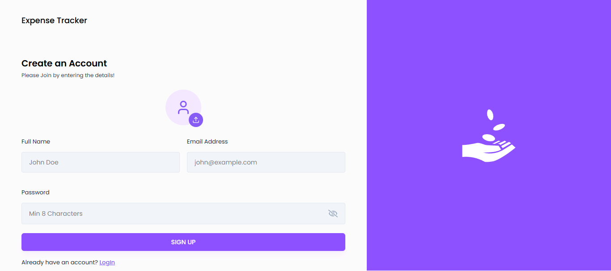
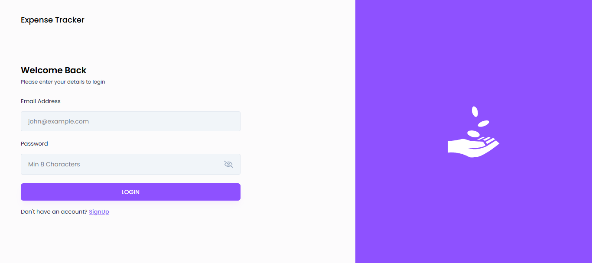
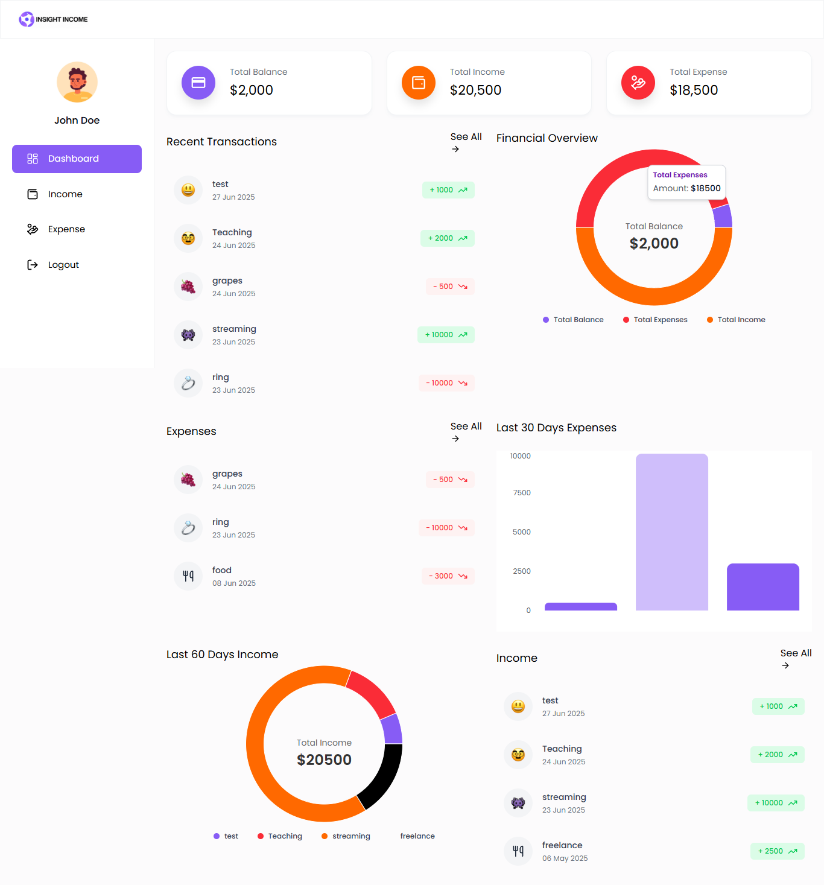
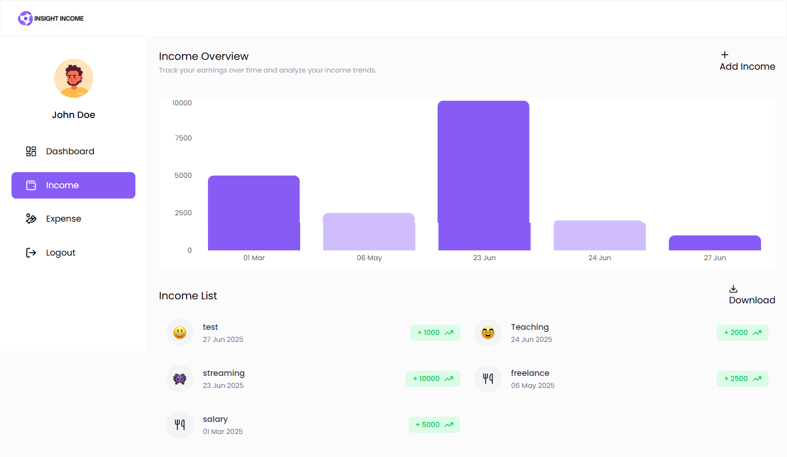
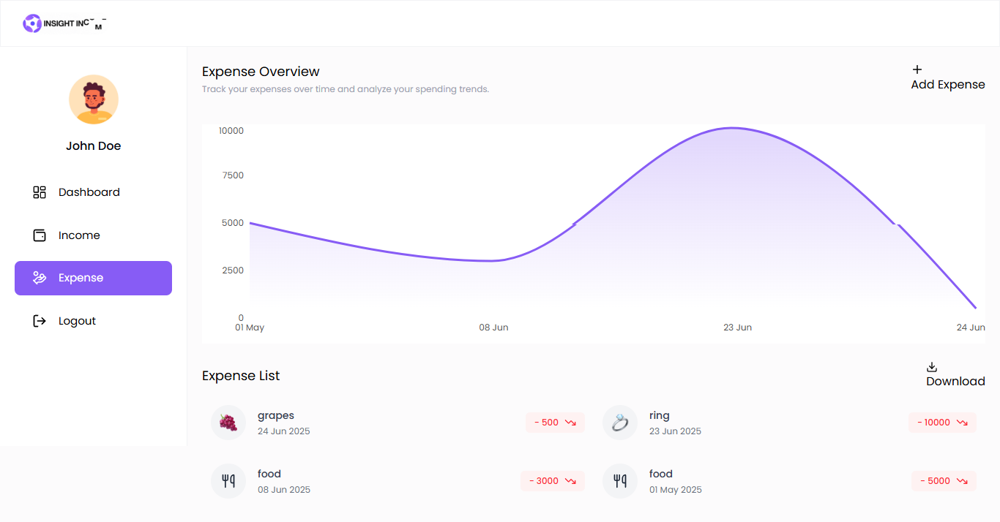

# Expense Tracker Application

This is a full-stack expense tracker application built with the MERN stack (MongoDB, Express.js, React.js, Node.js). It allows users to register, log in, and manage their income and expenses.

## Features

-   **User Authentication:** Users can sign up and log in to their accounts.
-   **Dashboard:** A comprehensive dashboard to view a summary of income and expenses.
-   **Income Management:** Users can add, view, and delete their income sources.
-   **Expense Management:** Users can add, view, and delete their expenses.
-   **Data Export:** Users can download their income and expense data as Excel files.

## Screenshots

### Sign Up

### Login

### Dashboard

### Income Management

### Expense Management

